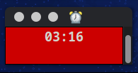

# flow.py



This is a quick python script for using the "flowtime technique". 

Explaining this has two parts, on one hand I'd have to explain its specific features. The other half of the explanation is why Flowtime.

It's easier to understand this as a follow up to [tomate.py](https://github.com/vexorian/tomate.py) , which was basically this but for the Pomodoro technique.

It's been many years I've used the Pomodoro technique and tomate.py was the result of me attempting to improve the way I interact with it. I was having issues finding a good app that adapted to what I needed:

* I want the timer to always be visible on the screen.
* Even at two monitors, screen real space is limited for me, so I don't want the timer to use too much space.
* Can't use indicators because I am not sure anymore if I will stick to my current Desktop UI in the long term (Canonical and GNOME keep making Unity less and less viable).
* Web applications are portable but web browsers have too large a footprint and they also use too much screen space.
* I need to be able to run special hook commands when the breaks/work start/end.

At the end, writing a pomodoro terminal script seemed like my best chance. I found it useful for it to color the whole terminal green or red depending on the timer in use. Once the command runs, you only need simple key presses like numbers, enter or ctrl+c to control the timer. You can configure it to run specialized commands when timers start or end. Additionally, I like having as little dependencies as possible running in my host computer,and python3 and a terminal app are some of the few things I can expect to have around regardless of what setup I am using. These are reasons why I couldn't just use the existing terminal pomodoro apps.

I use the command hooks to make notifications appear in my desktops. But you could use them for things like playing sounds, or making your phone ring, or controlling your smart bulb's color. Anything that you can trigger from running a command in your computer is possible.

## Why flowtime

Although the features of `tomate.py` were working quite well for me. There was a bit of a loose end.  After many years of trying to use Pomodoro I really can't look away anymore from my greatest issue with productivity. I always struggle with starting to work. It doesn't matter how efficient the Pomodoro technique can make your work sessions if you don't even start your own work sessions. All this time I just took this as a personal failing rather than a failing of the technique, I mean, it's not like Pomodoro is causing my to procrastinate, right?

Well, although Pomodoro is not the reason it takes so much effort to get into work, it's certainly not helping. And I started to read on the matter, googling trying to understand why doesn't Pomodoro work for me: https://zapier.com/blog/flowtime-technique/ . My conclusion personally is that Pomodoro makes "start to work" sound like you are about to work for 25 whole minutes and although 25 minutes is nothing, at the beginning of the day, my human brain perceives it as so much more effort than "just browsing the web for a couple more minutes".

There is another problem with Pomodoro and it is the reverse. Once I actually manage to convince myself to start working, something funny that happens is that the timer will sometimes hit the end while I am in the middle of intense work and ... the timer distracts stops my *flow*.

So I ended up giving it a try and it seems to work better for me. I'm sure there are people out there for whom Pomodoro works perfectly. But I'm not those people. My only problem left was that my script was designed for Pomodoro, so I had to update it for flowtime.


### So, how does it work?

You start a work session and the timer will keep going *up* while it is counting the amount of time you are spending on a work session.

You can stop the work session anytime you want (or when something stops your concentration). This earns you a break. Immediately after stopping a work session, the break will start and you can have your break during this time.

Now, we can't really be giving your brain that much freedom, so there is a catch. The longer you work continuously, the more break time you earn. But it's not just a linear formula. It's actually quadratic, this gives you encouragement to try to have longer periods of continuous work.

But another issue is that you actually do need to take breaks. So if a work session lasts for too long, there's a point where the timer will stop counting. So by then you'll gain nothing from continuing to work without a break.

### How to use it

 Requirements

* I haven't tested this on windows or OS/X and I don't particularly care about that.
* `pip3 install cursor`


## Usage

Edit flow.py, tweak the constants to your liking. Specially the formula. By editing the constants you can even configure the length of the timers and the specific sequence you want to use.

```
cd path/to/tomate.py
python3 tomate.py
```

The `0:00` appears, this means the timer is stopped. Start a work session by pressing Enter. The timer will keep increasing until you press enter again. This starts a break until it reaches `0:00` and you can start all over.

If you need to stop a break, halt the app with `Ctrl+C`.


## Note

I am just sharing the script. I don't intend this to become a real command or app. But I guess nothing stops you from forking it into it (aside of the GPLv3's terms)